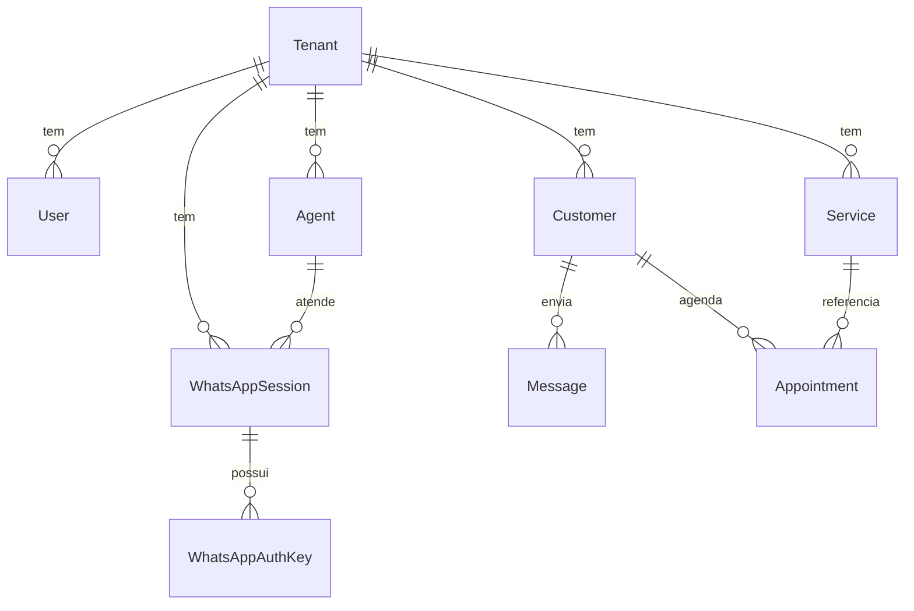

# Arquitetura do CodeIA Backend

## 📋 Visão Geral

O **CodeIA Backend** é uma API RESTful construída em **Fastify** que fornece infraestrutura para gerenciamento de agentes de IA com integração ao WhatsApp. O sistema segue uma arquitetura orientada a serviços com processamento assíncrono via workers.

### Principais Características

- 🏢 **Multi-tenancy**: Isolamento completo de dados por tenant
- 🤖 **IA Agêntica**: Integração com Google Gemini com function calling
- 📱 **WhatsApp Nativo**: Conexão via Baileys (não oficial, baseada em WebSocket)
- 📅 **Agendamento Inteligente**: IA pode criar/modificar agendamentos
- 🔄 **Processamento Assíncrono**: Workers dedicados para tarefas pesadas

## 🏗️ Arquitetura em Camadas

```
┌─────────────────────────────────────────────────────────┐
│                     API Layer (Fastify)                  │
│  ┌──────────┐  ┌──────────┐  ┌──────────┐  ┌─────────┐ │
│  │  Auth    │  │ WhatsApp │  │   CRM    │  │  Agents │ │
│  │  Routes  │  │  Routes  │  │  Routes  │  │  Routes │ │
│  └──────────┘  └──────────┘  └──────────┘  └─────────┘ │
└─────────────────────────────────────────────────────────┘
                           ↓
┌─────────────────────────────────────────────────────────┐
│                    Service Layer                         │
│  ┌──────────┐  ┌──────────┐  ┌──────────┐  ┌─────────┐ │
│  │   AI     │  │WhatsApp  │  │Appointment│ │ Settings│ │
│  │ Service  │  │ Manager  │  │  Service  │ │ Service │ │
│  └──────────┘  └──────────┘  └──────────┘  └─────────┘ │
└─────────────────────────────────────────────────────────┘
                           ↓
┌─────────────────────────────────────────────────────────┐
│                     Worker Layer                         │
│  ┌──────────────────────┐  ┌──────────────────────────┐ │
│  │  WhatsApp Worker     │  │   Reminder Worker        │ │
│  │  (BullMQ)            │  │   (Cron Job)             │ │
│  │  - Gerencia sockets  │  │   - Envia lembretes      │ │
│  │  - Processa msgs     │  │   - Verifica agendamentos│ │
│  └──────────────────────┘  └──────────────────────────┘ │
└─────────────────────────────────────────────────────────┘
                           ↓
┌─────────────────────────────────────────────────────────┐
│                     Data Layer                           │
│         ┌──────────┐           ┌──────────┐             │
│         │ Postgres │           │  Redis   │             │
│         │ (Prisma) │           │ (Cache+Q)│             │
│         └──────────┘           └──────────┘             │
└─────────────────────────────────────────────────────────┘
```

## 📂 Estrutura de Diretórios

```
src/
├── routes/              # Definição de rotas HTTP
│   ├── auth.routes.ts
│   ├── whatsapp.routes.ts
│   ├── ai.routes.ts
│   └── ...
├── services/            # Lógica de negócio
│   ├── ai.service.ts
│   ├── whatsapp-manager.service.ts
│   ├── whatsapp.worker.ts
│   ├── reminder.worker.ts
│   └── ...
├── lib/                 # Utilitários e configuração
│   ├── prisma.ts
│   ├── redis.ts
│   ├── logger.ts
│   └── queues.ts
├── plugins/             # Plugins Fastify
│   ├── context.plugin.ts
│   └── error-handler.plugin.ts
└── server.ts            # Ponto de entrada
```

## 🔄 Fluxo de Processamento de Mensagens WhatsApp

### 1. Inicialização da Sessão

```
User (Frontend)
    ↓ POST /whatsapp/start
API (whatsapp.routes.ts)
    ↓ enfileira job START_SESSION
BullMQ Queue (Redis)
    ↓ worker processa job
WhatsAppWorker
    ↓ cria socket Baileys
    ↓ publica QR Code via Redis Pub/Sub
    ↓ aguarda autenticação
```

### 2. Recebimento de Mensagem

```
WhatsApp (Cliente final)
    ↓ envia mensagem
Baileys (Socket)
    ↓ evento 'messages.upsert'
WhatsAppWorker.handleIncomingMessages()
    ↓ salva Customer no banco
    ↓ salva Message no banco
    ↓ carrega histórico (últimas 10 mensagens)
AIService.chat()
    ↓ monta prompt com contexto (serviços, horários)
    ↓ envia para Gemini
    ↓ processa function calls (createAppointment, etc)
    ↓ retorna resposta
WhatsAppWorker
    ↓ envia resposta via socket
    ↓ salva resposta no banco
```

### 3. Agendamento via IA

```
Cliente: "Quero agendar corte de cabelo amanhã às 14h"
    ↓
AIService detecta intenção de agendamento
    ↓ executa function call: createAppointment
    ↓ args: { serviceName: "corte", dateTime: "2026-02-03T14:00:00-03:00" }
AppointmentService.createAppointment()
    ↓ valida horário de funcionamento
    ↓ verifica disponibilidade
    ↓ cria registro no banco
    ↓ retorna confirmação
AIService
    ↓ envia resposta amigável: "Pronto! Agendei seu corte..."
```

## 🗄️ Modelo de Dados (Simplificado)



## 🔐 Autenticação e Autorização

### JWT Flow

1. **Login**: `POST /auth/login` → retorna token JWT
2. **Validação**: Middleware valida token em rotas protegidas
3. **Context**: Plugin injeta `tenantId` e `userId` no contexto da requisição

### Isolamento Multi-tenant

Todas as queries incluem filtro por `tenantId`:

```typescript
prisma.agent.findMany({ where: { tenantId } });
```

## 🚀 Escalabilidade

### Workers Independentes

- **WhatsAppWorker** pode rodar em processo separado
- **ReminderWorker** é um cron job isolado
- Comunicação via **Redis** (BullMQ + Pub/Sub)

### Estratégias de Escala

1. **Horizontal**: Múltiplas instâncias da API (stateless)
2. **Worker Scaling**: Aumentar concurrency do BullMQ
3. **Database**: Connection pooling do Prisma
4. **Cache**: Redis para sessões ativas e status

## 🔧 Tecnologias Core

| Camada   | Tecnologia          | Propósito                |
| -------- | ------------------- | ------------------------ |
| API      | Fastify             | Framework HTTP rápido    |
| Database | PostgreSQL + Prisma | ORM type-safe            |
| Queue    | BullMQ + Redis      | Jobs assíncronos         |
| AI       | Google Gemini       | LLM com function calling |
| WhatsApp | Baileys             | Biblioteca não-oficial   |
| Logging  | Pino                | Logs estruturados        |

## 📊 Monitoramento (Futuro)

### Métricas Importantes

- ✅ Tempo de resposta da API
- ✅ Taxa de sucesso de conexões WhatsApp
- ✅ Latência do processamento de IA
- ✅ Uso de memória dos workers
- ✅ Taxa de falha de jobs

### Health Checks

- `GET /health`: Status da API
- `GET /ready`: API + Database + Redis

## 🛡️ Segurança

- ✅ Senhas hasheadas com bcrypt
- ✅ JWT com secret configurável
- ✅ CORS configurado
- ⚠️ Rate limiting (TODO)
- ⚠️ Validação de input (TODO: centralizar com Zod)

## 📝 Próximos Passos

1. Implementar DTOs centralizados com Zod
2. Adicionar rate limiting
3. Configurar APM (Application Performance Monitoring)
4. Melhorar tratamento de erros (custom error classes)
5. Documentação OpenAPI completa

---

**Última atualização:** 02/02/2026  
**Versão:** 1.0.0
